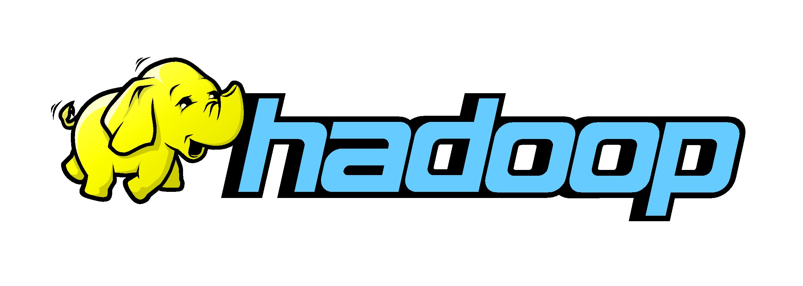
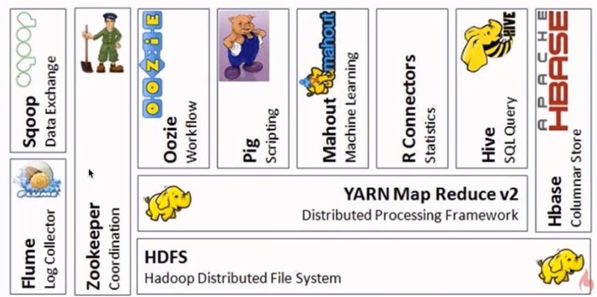

## qs-hadoop
  此项目用于学习大数据hadoop生态圈以及spark生态圈
  


  

  
  
### 组织结构

``` lua
qs-hadoop
├
├── qs-hadoop-elasticsearch-springboot -- elasticsearch集成springboot以及基本使用
|
├── qs-hadoop-elasticsearch-starter -- elasticsearch开始使用
|
├── qs-hadoop-file -- 学习相关的资料文件、以及遇到的坑点笔记
|
├── qs-hadoop-flink -- 分布式数据流处理和批量数据处理框架 flink 初次见面
|
├── qs-hadoop-hdfs -- hadoop核心框架-分布式文件系统的java api的基本使用
|
├── qs-hadoop-ipParser -- 一个ip地址数据库，用于解析ip获取地址
|
├── qs-hadoop-kafka -- kafka生产者、消费者使用
|
├── qs-hadoop-logger -- 用于产生类似nginx访问日志的产生
|
├── qs-hadoop-mapreduce -- hadoop核心框架-分布式计算框架mapreduce java api编程实现
|
├── qs-hadoop-spark -- 基于sparkContext的wordcount Demo
|
├── qs-hadoop-sparkSQL -- 基于scala编程的spark核心dataset、dataframe的使用以及hive on spark等使用
|
├── qs-hadoop-sparkStream -- 基于scala编程的sparkstreaming是基本使用，分别集成flume、kafka日志收集
|
├── qs-hadoop-sparkStream-action -- 基于scala编程的sparkstreaming实战，集成flume、kafka做实时流处理的日志分析项目实战
|
├── qs-hadoop-streaming-action-webUi -- 基于java springboot编程的sparkstreaming实战数据图像化展示web ui界面(echarts)
|
├── qs-hadoop-userBehaviorLog -- 基于java编程的Mapreduce nginx日志用户行为离线处理分析,统计nginx用户访问日志的os个数
|
├── qs-hadoop-userLog-scala -- 基于scala编程的spark nginx日志用户行为离线处理分析
|
├── qs-hadoop-webUi -- 基于java servlet编程的spark nginx日志用户行为离线处理分析的数据图像化展示web ui界面(echarts)
|
├── qs-hadoop-spring -- HDFS集成java spring开源框架的基本使用
|
├── qs-hadoop-springboot -- HDFS集成java springboot开源框架的基本使用
|
├── qs-hadoop-storm -- storm实时流计算的使用
``` 

### 涉及到的编程语言及技术框架
#### 编程语言
- java 1.8.0_161
- scala 2.11.12

#### 技术框架及选型
- hadoop 2.6.0 (cdh5.7.0)

- spark 2.1.0 (cdh5.7.0)

- flink 1.5.0 （cdh5.7.0）

- flume 1.6.0 (cdh5.7.0)

- kafka kafka_2.11-0.9.0.0

- hbase 1.2.0 (cdh5.7.0)

- elasticsearch 5.2.0

- hive 1.1.0 (cdh5.7.0)

- spring boot 2.0.3.RELEASE

- echarts 3.3.1

- zookeeper-3.4.5 (cdh5.7.0)

- storm 1.1.2

### 结束语
> 本项目仅用于学习大数据生态圈使用，很多地方都是仅仅是demo形式，
> 还有很多东西需要改进。
> 项目随着学习进度持续更新...